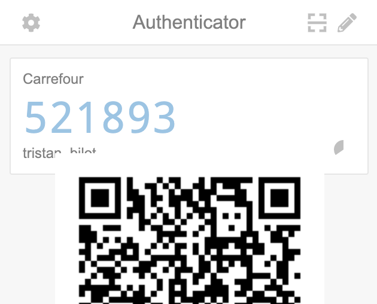
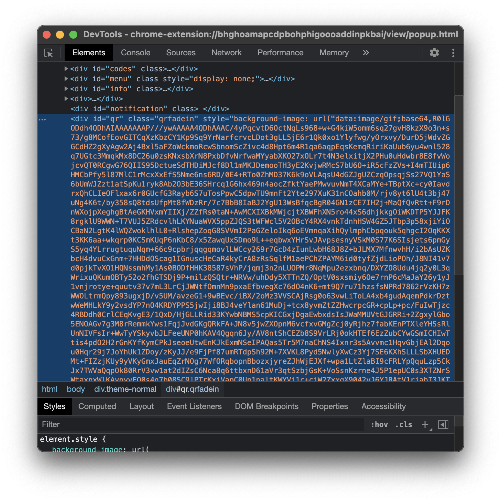
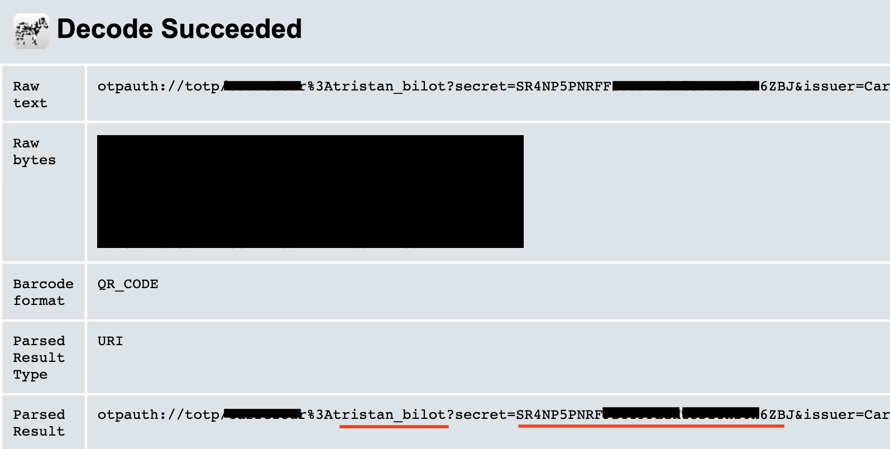

# Extract Google-Authenticator code from the Chrome extension
You may need to use a Google-Authenticator OTP for applications, you can achieve this by exporting the QR-code from the extension, reading the secrets info hidden into it and finally using the same algorithm used to produce the code in order to make a "copy".

* In the Google-Authenticator Chrome extension, click on the QR-code icon in order to display it. Then, right click on the image and click "inspect" to open the element examinator.
* Copy the content of the image in an editor, then select all the content between "base64," to "==". Be careful, "==" needs to be present in the selection.
<p align="center">
  
  
</p>

* Then go to https://codebeautify.org/base64-to-image-converter to convert the base64 selected content to an image: the QR-code.
* You have the QR-code, now we have to extract the secret information, go to https://zxing.org/w/decode and upload your QR-code png image.

<p align="center">
  
</p>

* Copy your "username" and your secret key (underlines in red on the image).
* Clone https://github.com/grahammitchell/google-authenticator.
* Edit secrets.json and replace the values by the you copied.


```python
{
  "username": "secret key"
}
```

* Run the Python script.

```python
>>> python2 google-authenticator.py
tristan_bilot:	193188 # <<- your OTP code
```
